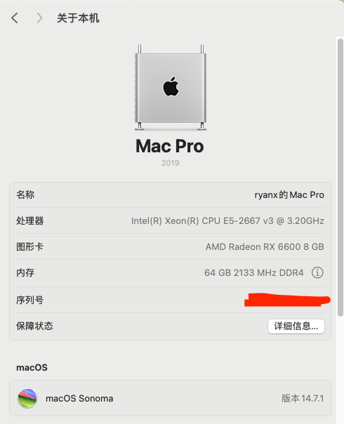

### 完成度: 99%

前段时间为了玩黑猴组了套垃圾佬机器，发现很适合搞黑果。

* 主板: 爱国者aigo x99 D4Max。230元
    * 原生c612芯片组，四通道D4
    * 4倍8相供电自带mos风扇
    * 两个m2接口1个无线网卡接口
    * 支持s3睡眠(windows和macos)
* cpu: intel e5-2667v3，8C16T。40元
    * v3系列的u，内存频率最大2133MHZ，bios可修改时序至C12-12-12-30
* 内存: DDDR4 ECC 64GB(16GB*4 三星)。300元
* 无线网卡: intel ax210。存货
    * 由于intel无线网卡驱动问题，暂未上macos15，参考：[itlwm](https://github.com/OpenIntelWireless/itlwm)
* 显卡: rx6600。存货
    * mac免驱(boot-args添加 agdpmod=pikera)



# 概览

| OpenCore Version | 1.0.2           |
|------------------|-----------------|
| Bios Version     | 默认(没注意)         |
| macOS Version    | 14.7.1 (Sonoma) |
| SMBios           | MacPro7,1       |

| Hardware       | Specification           | Status    |
|----------------|-------------------------|-----------|
| CPU            | Intel E5-2667 v3        | ✅ Working |
| GPU            | rx6600免驱                | ✅ Working |
| Audio          | ALC897(我没用到，随便填了个alcid) | 🔶 TODO   | 
| WiFi&Bluetooth | Intel AX210NGW          | ✅ Working |
| USB            | xhci                    | ✅ Working |
| sleep/wake     | s3 sleep                | ✅ Working |

# Config.plist

使用[GenSMBIOS](https://github.com/corpnewt/GenSMBIOS)
或者 [macserial(内置于OpenCorePkg)](https://github.com/acidanthera/OpenCorePkg) 生成你自己的机型配置。  
例如：

```
Type:         MacPro7,1
Serial:       F5KHC4Y1P7QM
Board Serial: F5K209600GUK3F7UE
SmUUID:       681B7CCE-0EEA-4C2B-B63D-C797E38BD73C
Apple ROM:    D0034B191F17

```

# USB定制

我的机箱前置两个3.0接口在主板的3.0usb插针，具体参考usb.txt文件。也可以按照你自己的情况更改你的定制文件
`EFI/OC/Kexts/USBMap.kext/Contents/Info.plist`

# BIOS 设置

先恢复默认设置，然后按照下面改动

```
Advanced
  — CSM Configuration: Disable
  — USB Configuration
    — Port 60/40 Emulation: Disabled
IntelRCSetup
  — Processor Configuration
    — MSR Lock Control: Disable
```

